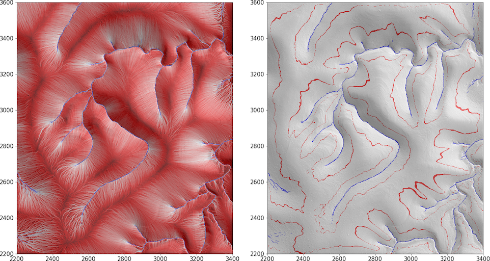

 .. py:module:: slm

Topographic streamline analysis
##########################################

The `Streamlines`_ project provides a suite of Python tools to study the 
structure of surface-water flow on large digital terrain models (DTMs). 
It takes the form of a Python 3 package, called :py:mod:`slm`, which uses
:ref:`numba <numba:install_frontpage>` and :mod:`PyOpenCL <pyopencl>` 
to speed up processing, along with some demo Jupyter/IPython notebooks, 
and a custom set of `open-source lidar DTM`_ data files for the notebooks to work on.

.. warning::
	This documentation is a work in progress. 
	Recent deployments of OpenCL acceleration 
	and splitting of the git repo are being incorporated now.

The novelty of the `Streamlines`_ method lies in how it computes the convergence and 
divergence of terrain driven flow. 
Instead of taking the usual, flow-routing approach at the pixel-scale, it traces 
topographic streamlines at a sub-pixel resolution
and then processes them to compute useful properties such as drainage density and 
hillslope length distributions.

The streamlines are derived in the `fluid dynamics sense`_ by treating the gradient vector 
field of the terrain as a 2D pattern of conservative (zero divergence) steady flow. 
Flow trajectories are integrated across 
this vector field from (generally) every DTM grid cell not just in the downstream 
direction, but also upstream. 
The pixel-densities of up-streamlines and down-streamlines, together with their 
stream length distributions, are then computed at the DTM grid resolution.
It turns out that important geometric and topological properties of the landscape 
are revealed by analyzing
these properties. In particular, they help reveal: (1) channel heads and terminations 
(e.g., on alluvial fans), 
(2) channel density, and (3) hillslope length.

A key innovation in `Streamlines`_ is a tool to overcome non-zero-divergence artefacts that arise
when a DTM is preconditioned by having its sinks and pits filled. Pit filling is required of any 
DTM that is to be loaded into and processed by `Streamlines`_ -- much as any flow routing software requires.
The problem is that if the gradient vector field of a 'corrected' DTM is computed at the grid resolution,
there will inevitably be places (particularly at single-diagonal-outflow pixels adjacent to filled pits)
where gradient vectors *appear* to converge. If the DTM could be corrected at a sub-pixel resolution (such as 
by resolving an outflow channel), this convergence probably would not occur. Rather than attempting such sub-pixel
trickery prior to calculating the gradient vector field at an oversampled resolution, 
algorithms (see the :mod:`preprocess <streamlines.preprocess>` module) that overcome the artefacts 
are applied directly the gradient field at the DTM grid resolution. 
These algorithms require some tuning to overcome all such errors.

How it works
************

Computation of streamlines across a topographic surface involves the following workflow:

.. toctree::
   :glob:
   :maxdepth: 1
   
   Read DTM and related geodata files <documentation/geodata>
   Preprocess DTM <documentation/preprocessing>
   Trace streamlines <documentation/trace>
   Analyze streamline densities & distributions <documentation/analysis>
   Map channels etc <documentation/mapping>
   Plot maps & graphs <documentation/plot>
   Save state <documentation/state>
   Export graphics <documentation/export>

Technical stuff
***************
  
.. note::
	Mapping streamlines across a large DTM from every pixel is a cumbersome task, 
	both in terms of processing and in memory use. Two big steps have been made to 
	speed up the code so that, RAM permitting, very large DTMs can be analyzed.
	
	The first step was to deploy `Numba`_ to accelerate the 
	rate-limiting (2nd order Runge-Kutta) integration code. 
	A boost in speed of **around 135x** was achieved.
	Given what is known of the efficiency of Numba, this boost brought the Python 
	code within a factor of 1--5 of the speed we would see in a version hard-coded 
	in C/C++ [#f1]_, [#f2]_, Fortran [#f3]_, etc. 
	
	The challenge with `Numba`_ is that it's deceptively easy to apply: just slap on an
	`@jit`_ decorator to your slow function or method, and *bingo!* it goes faster. 
	However, for the JIT compilation to really work its magic the function in question
	needs to be tranformed into a rather non-pythonic form: divested of objects, as strongly
	typed as possible, and stateless. The up-side to neutering the code like this
	is that it is excellent preparation for the next step...
	
	The second step was (and is ongoing) to deploy `PyOpenCL`_
	and to adapt the Runge-Kutta integration code into a GPU-compute form. 
	This effort was not as tough as expected, since migration to `Numba`_
	entailed conversion to a form of Python rendered it easy to translate 
	into `OpenCL`_. Currently, this GPU-accelerated version of `Streamlines`_
	is **about 1500x faster** than the raw, Pythonic, original Python code.
	Further optimizations are expected to boost the speed further.
	

-----------------------------------------------------------
Getting started
-----------------------------------------------------------

 
.. toctree::
   :glob:
   :maxdepth: 1
   
   Prerequisites <documentation/prerequisites>
   Setting paths <documentation/install>

-----------------------------------------------------------
Running the code
-----------------------------------------------------------

`Streamlines`_ workflow can be carried out in several ways:

.. toctree::
   :glob:
   :maxdepth: 1
   
   How to run in a Jupyter notebook,  Jupyter console, QtConsole, or shell <documentation/howtorun>

-----------------------------------------------------------
Controlling the workflow 
-----------------------------------------------------------

`Streamlines`_ computation and analysis is controlled by supplying workflow parameters and (optionally) command line arguments.
The parameters are contained in JSON files that are loaded at the beginning of operations.  

First, default parameter values are assigned by parsing the :doc:`defaults.json <modules/defaults_json>` 
file located in the `streamlines package directory`_. 
Second, a 'job' parameters file is parsed that overrides the default values where needed.
Third, key workflow parameters may be assigned when invoking `Streamlines`_ computation from the command line or 
with an explicit Python call from a script or notebook. Such options override the JSON-parsed values.

Here is an example sequence of files in which parameters are assigned and streamline computation, 
postprocessing and plotting are carried out:

.. toctree::
   :maxdepth: 1

   modules/defaults_json
   Tests/IndianCreek2_json
   Tests/IndianCreek2_nb
   
   
More substantial demo analyses can be found in `IndianCreek2.ipynb`_ and 
`GuadalupeMtns1.ipynb`_. Rather bigger DTM analyses are illustrated in 
`GuadalupeMtns2.ipynb`_, `GuadalupeMtns3.ipynb`_ and `IndianCreek3.ipynb`_.
 
   

-----------------------------------------------------------
Explanation of Python modules and OpenCL programs
-----------------------------------------------------------

The `Streamlines`_ Python package is built around the following:

* :ref:`modindex`

In a typical workflow, the key modules are employed in a sequence like this: 

.. toctree::
   :maxdepth: 1

   modules/initialize   
   modules/slm
   modules/streamlining
   modules/parameters
   modules/state
   modules/core
   modules/geodata
   modules/preprocess
   modules/trace
   modules/analysis
   modules/mapping
   modules/plot
   modules/save

PyOpenCL and OpenCL code is used by :doc:`modules/trace`  and :doc:`modules/mapping` and 
consists of the following:
		
.. toctree::
   :maxdepth: 1

   modules/pocl
   modules/useful
   modules/channelheads
   modules/connect
   modules/countlink
   modules/fields
   modules/hillslopes
   modules/kde
   modules/label
   modules/lengths
   modules/segment
   modules/trajectories
   modules/channelheads.cl
   modules/computestep.cl
   modules/connect.cl
   modules/countlink.cl
   modules/essentials.cl
   modules/hillslopes.cl
   modules/integratefields.cl
   modules/integratetraj.cl
   modules/jittertrajectory.cl
   modules/kde.cl
   modules/label.cl
   modules/lengths.cl
   modules/rng.cl
   modules/rungekutta.cl
   modules/segment.cl
   modules/trajectory.cl
   modules/updatetraj.cl
   modules/writearray.cl

  
.. only:: html 

The OpenCL code is best explored in the `Doxygen documentation`_.

Indexes and search
******************

* :ref:`genindex`
* :ref:`search`

.. _Several example notebooks: https://github.com/cstarknyc/slmnb
.. _Streamlines repo: https://github.com/cstarknyc/slm
.. _Streamlines: https://github.com/cstarknyc/slm
.. _streamlines package directory: https://github.com/cstarknyc/slm/python/streamlines
.. _fluid dynamics sense: https://en.wikipedia.org/wiki/Streamlines,_streaklines,_and_pathlines
.. _IndianCreek2.ipynb: https://github.com/cstarknyc/slmnb/SmallTests/IndianCreek2.ipynb
.. _IndianCreek3.ipynb: https://github.com/cstarknyc/slmnb/BigTests/IndianCreek3.ipynb
.. _GuadalupeMtns1.ipynb: https://github.com/cstarknyc/slmnb/SmallTests/GuadalupeMtns1.ipynb
.. _GuadalupeMtns2.ipynb: https://github.com/cstarknyc/slmnb/SmallTests/GuadalupeMtns2.ipynb
.. _GuadalupeMtns3.ipynb: https://github.com/cstarknyc/slmnb/BigTests/GuadalupeMtns3.ipynb
.. _Numba: http://numba.pydata.org/numba-doc/dev/index.html
.. _PyOpenCL: https://documen.tician.de/pyopencl/index.html
.. _OpenCL: https://www.khronos.org/opencl
.. _@jit: http://numba.pydata.org/numba-doc/dev/user/jit.html
.. _Doxygen documentation: https://cstarknyc.github.io/slm/opencl/
.. _open-source lidar DTM: https://www.opentopography.org/

References
**********

.. [#f1] `A Speed Comparison Of C, Julia, Python, Numba, and Cython on LU Factorization \
	 <https://www.ibm.com/developerworks/community/blogs/jfp/entry/A_Comparison_Of_C_Julia_Python_Numba_Cython_Scipy_and_BLAS_on_LU_Factorization?lang=en>`_
.. [#f2] `Numba Versus C++ \
	 <https://murillogroupmsu.com/numba-versus-c>`_
.. [#f3] `Comparison of performance: Python NumPy and Numba, MATLAB, and Fortran  \
	 <http://jekel.me/2017/Python-with-Numba-faster-than-fortran/>`_
